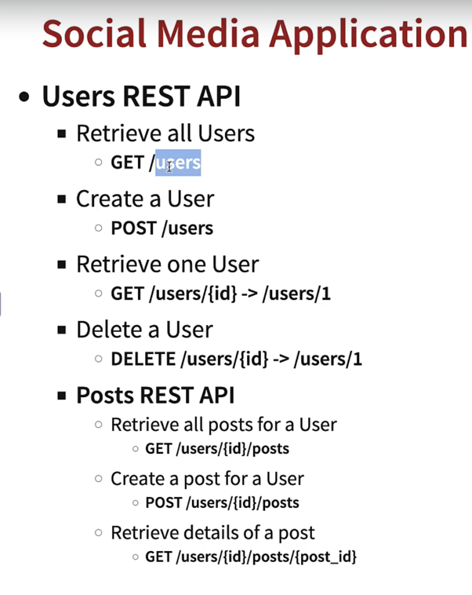
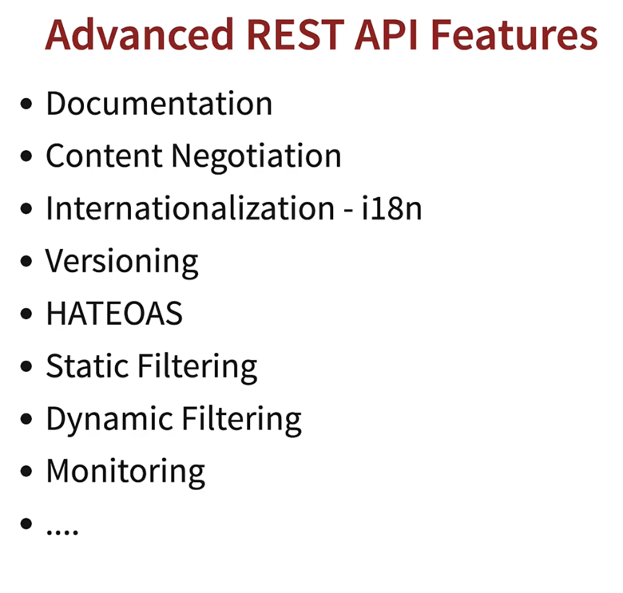
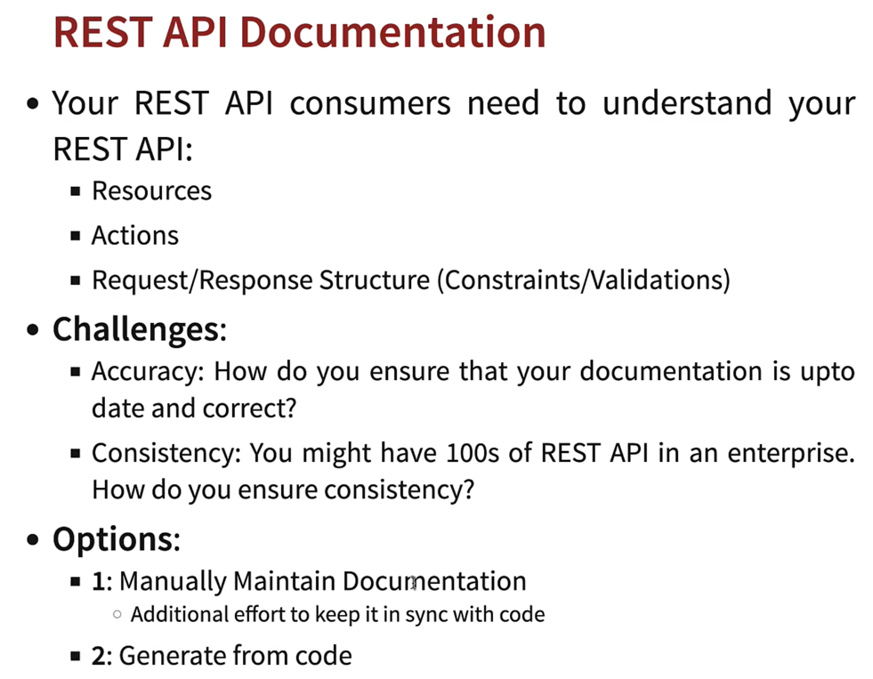
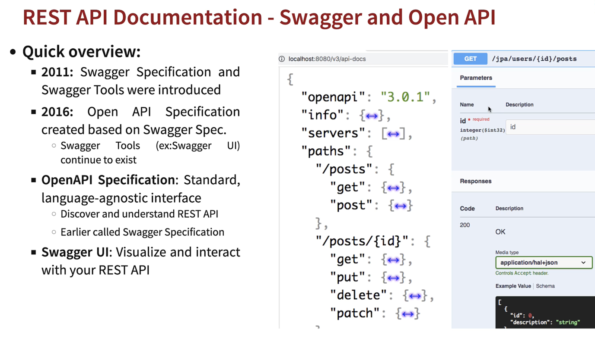
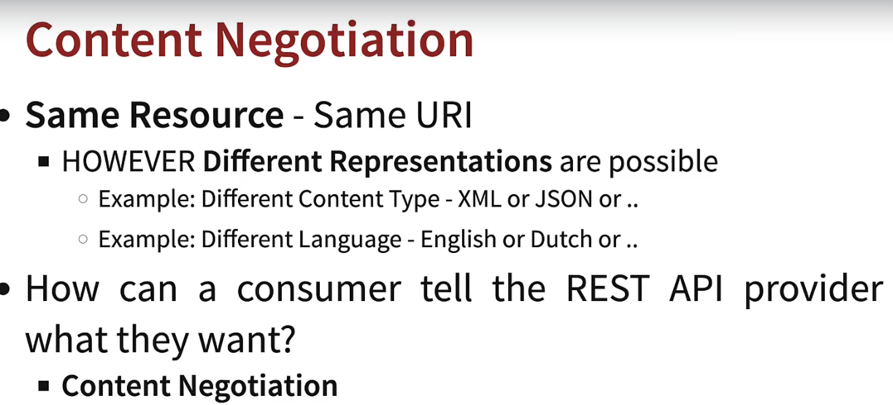
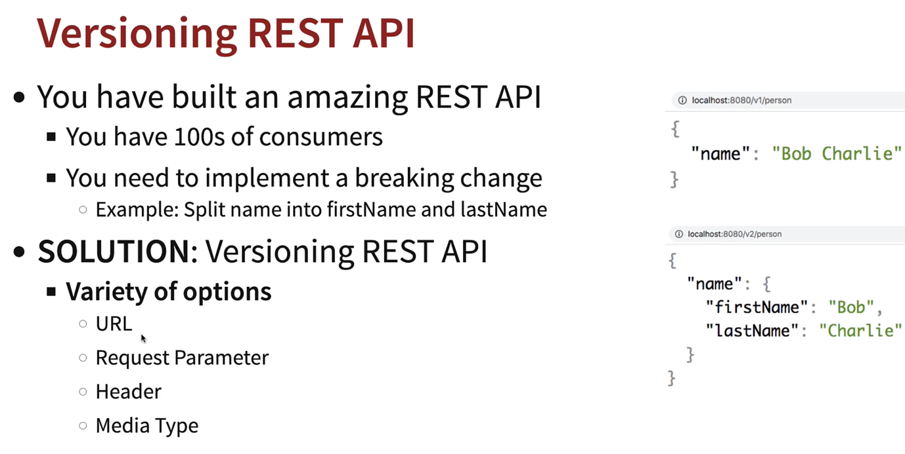
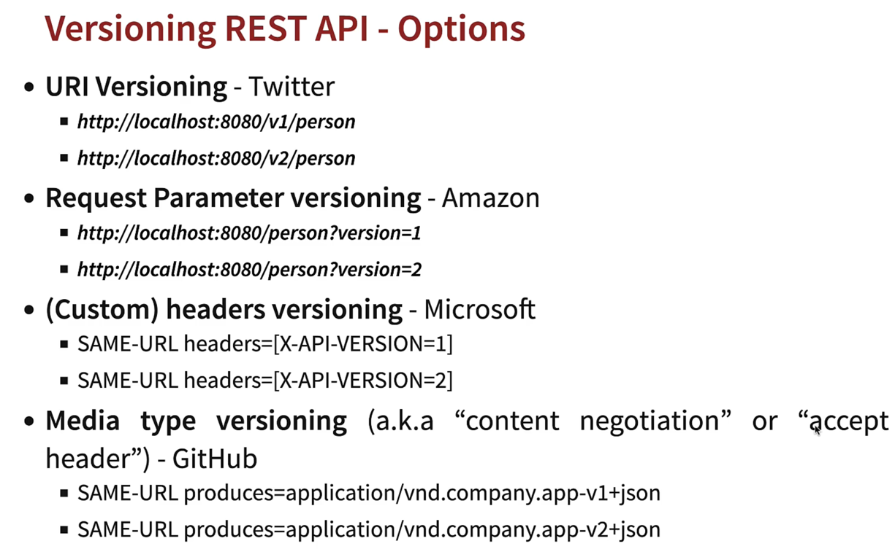
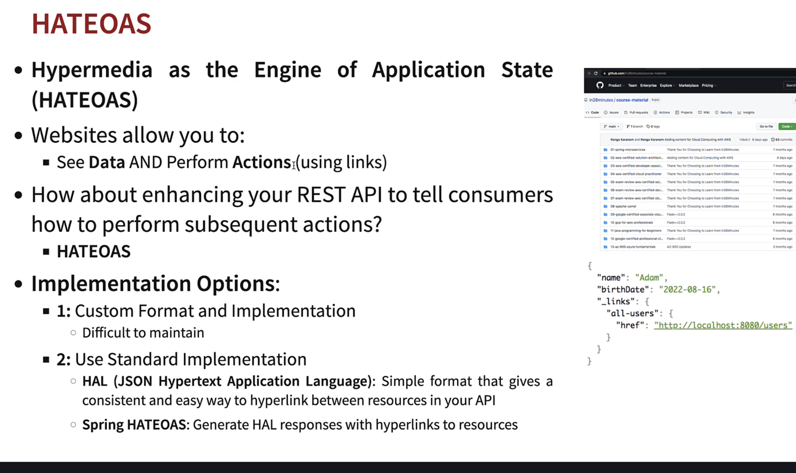
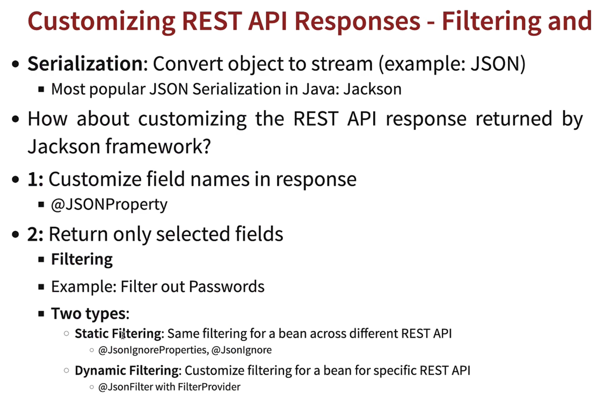
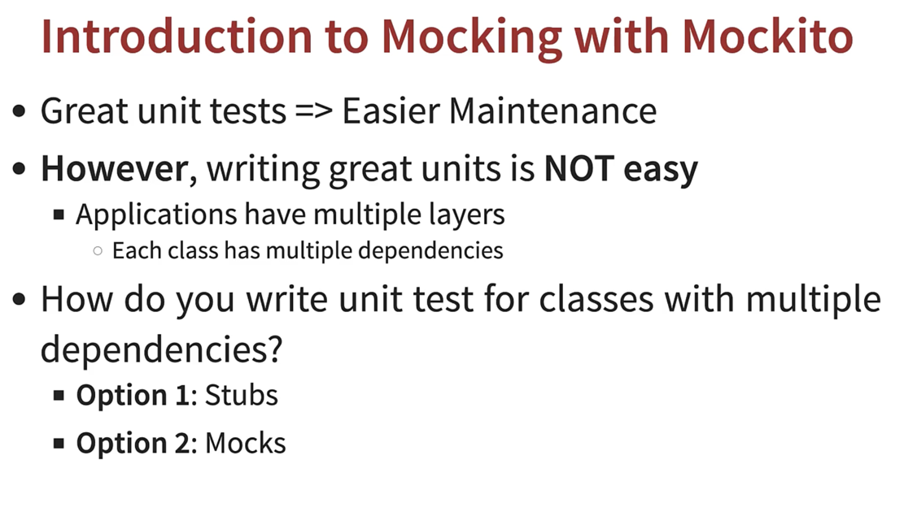

- Put   : to update an existing resources
- Patch : to update part of resource

-  Key resources: Users, Posts
    - key details: User: id, name , birthplace | Posts: id, descreption.

- Choosing the right request method for actions (GET, POST, PUT, DELETE, …)
  - Users REST API
       - Retrieve all Users   : GET /users
       - Create a User        : POST /users
       - Retrieve one User    : GET /users/{id} → /users/1
       - Delete a User        : DELETE /users/{id} → /users/1
  - Posts REST API
       - Retrieve all posts for a User     : GET /users/{id}/posts
       - Create a post for a User          : POST /users/{id}/posts
       - Retrieve details of a post        : GET /users/{id}/posts/{post_id}
  
  - getAll, getOne, post
  - ResponseEntity on Post, 
  - we applied Exception on retrieving non-existing user(creating UserNotFoundException class).
  - DeleteUSer
    - Now suppose while creating user, we didnt pass the name so for that we are going to apply the validations.
        -  For that import the dependency starter-validation.
        -  use @Valid on post controller and apply validation on fields on User class like @Size, @Past

       
    
      
      - Configuring Auto generation of Swagger Documentation
         - First, inject the dependency in POM
         - Hit localhost:8080/swagger-ui.html
      
    
        - Content Negotiation
           - For that, dependecy in POM
           - Hit the postman, header: Key: Accept value: application/xml or Json. 
        
    
        ##  Versioning API : creating versioning controller for that.
          - 
          - 
             - Do the configuration in Application properties
             - There are new ways in spring boot newer versions check those as well.
        ## HATEOS
            - 
            - First Inject the dependency in the pom file
            - While retrieving the users, we want the user to give link back as well
            - For that we will wrap the User into EntityModel in GetById controller, nd to create link there is another class which is WebMvcLinkBuilder
        ## Static Filtering
          - 
          - Make use of @JsonProperty on user Bean class.
          - Return only selected fields : Filtering
              - 1. static : @JsonIgnoreProperties, @JsonIgnore
              - 2. Dynamic : Define the views.  
        - Spring Boot Actuators
              1. Add the dependency, hit /actuators
              2. want to manage the endpoints, management.endpoints.web.exposure.includes=*
        - HAL explorer
              - 
              - add the dependency spring-data-rest-hal-explorer
              - hit /

- Now Connect to H2-console
- Create UserRepository through which user can talk to database.
- Now Post Rest-APIs, create new Entity class name Post
- Now mapped the both Post with user and user with post with (manytoOne & oneToMany), also with JsonIgnore.
- When we fetch post, we dont want to fetch the user details that r associate with post
      - for that we use (fetch = fetchType.Lazy) 

  - Now we will build Post APIs: 
       -   Retrieve all posts for a User : GET/users/id/posts
       -   Create a post for User        : POST/users/{id}/posts

  ## Now we are switching from One database to another.
     -  Which is Sql database : inject the dependency and configure the app properties file
     -  Run this script in the terminal to launch MYSQL as docker container.
                 docker run
                   --detach 
                   --env MYSQL_ROOT_PASSWORD=dummypassword 
                   --env MYSQL_USER=social-media-user 
                   --env MYSQL_PASSWORD=dummypassword 
                   --env MYSQL_DATABASE=social-media-database
                   --name mysql 
                  --publish 3306:3306 mysql:8-oracle
     -  Now create insert data using postman and hit the endpoints.
     -  Also run these commands in mysql shell, to see table and all.
                         mysqlsh
                         \connect social-media-user@localhost:3306
                         \sql
                         use social-media-database
                         select * from user_details;
                         select * from post;
                         \quit

  ## Spring Security
             -  By applying dependency, not able to access the endpoint.
             -  Do the custom config for creating own username & password in app prop file.
             -  whenever you send a request, spring security intercept that request and would execute a series of filters, called filter chains.
                     -  there are series of filter which are checked like :
                                    -  All the requests should be authenticated
                                    -  If a request is not authenticated, a web page is shown
                                    -  CSRF -> Post, Put
                     -  Now If we want override these config and make our own, we will create Spring config for that.

- JUnit
       - 
- Mokito
       -  
